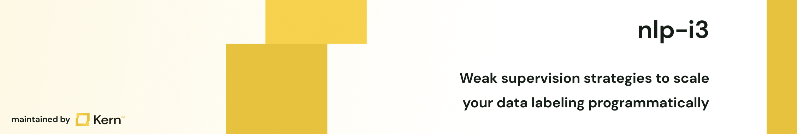

# 🔮 weak-nlp
Intelligent information integration based on weak supervision

## Installation
You can set up this library via either running `$ pip install weak-nlp`, or via cloning this repository and running `$ pip install -r requirements.txt` in your repository.

A sample installation would be:
```
$ conda create --name weak-nlp python=3.9
$ conda activate weak-nlp
$ pip install weak-nlp
```

## Usage
The library consists of three main entities:
- **Associations**: an association contains the information of one record <> label mapping. This does not have to be ground truth label for a given record, but can also come from e.g. a labelfunction (see below for an example).
- **Source vectors**: A source vector combines the created associations from one logical source. Additionally, it marks whether the respective source vector can be seen as a reference vector, such as a manually labeled source vector containing the *true* record <> label mappings.
- **Noisy label matrices**: Collection of source vectors that can be analyzed w.r.t. quality metrics (such as the confusion matrix, i.e., true positives etc.), quantity metrics (intersections and conflicts) or weakly supervisable labels.

The following is an example for building a noisy label matrix for a classification task
```python
import weak_nlp

def contains_keywords(text):
    if any(term in text for term in ["val1", "val2", "val3"]):
        return "regular"

texts = [...]

lf_associations = []
for text_id, text in enumerate(text):
    label = contains_keywords(text)
    if label is not None:
        association = weak_nlp.ClassificationAssociation(text_id, label)
        lf_associations.append(association)

lf_vector = weak_nlp.SourceVector(contains_keywords.__name__, False, lf_associations)

ground_truths = [
    weak_nlp.ClassificationAssociation(1, "clickbait"),
    weak_nlp.ClassificationAssociation(2, "regular"),
    weak_nlp.ClassificationAssociation(3, "regular")
]

gt_vector = weak_nlp.SourceVector("ground_truths", True, ground_truths)

cnlm = weak_nlp.CNLM([gt_vector, lf_vector])
```

Whereas for extraction tasks, your code snippet could look as follows:
```python
import weak_nlp

def match_keywords(text):
    for idx, token in enumerate(text.split()):
        if token in ["val1", "val2", "val3"]:
            yield "person", idx, idx+1 # label, from_idx, to_idx

texts = [...]

lf_associations = []
for text_id, text in enumerate(text):
    for triplet in match_keywords(text):
        label, from_idx, to_idx = triplet
        association = weak_nlp.ExtractionAssociation(text_id, label, from_idx, to_idx)
        lf_associations.append(association)

lf_vector = weak_nlp.SourceVector(match_keywords.__name__, False, lf_associations)

ground_truths = [
    weak_nlp.ExtractionAssociation(1, "person", 1, 2),
    weak_nlp.ExtractionAssociation(2, "person", 4, 5),
]

gt_vector = weak_nlp.SourceVector("ground_truths", True, ground_truths)

enlm = weak_nlp.ENLM([gt_vector, lf_vector])
```

## Roadmap
If you want to have something added, feel free to open an [issue](https://github.com/code-kern-ai/weak-nlp/issues).

## Contributing
Contributions are what make the open source community such an amazing place to learn, inspire, and create. Any contributions you make are **greatly appreciated**.

If you have a suggestion that would make this better, please fork the repo and create a pull request. You can also simply open an issue with the tag "enhancement".
Don't forget to give the project a star! Thanks again!

1. Fork the Project
2. Create your Feature Branch (`git checkout -b feature/AmazingFeature`)
3. Commit your Changes (`git commit -m 'Add some AmazingFeature'`)
4. Push to the Branch (`git push origin feature/AmazingFeature`)
5. Open a Pull Request

And please don't forget to leave a ⭐ if you like the work! 

## License
Distributed under the Apache 2.0 License. See LICENSE.txt for more information.

## Contact
This library is developed and maintained by [kern.ai](https://github.com/code-kern-ai). If you want to provide us with feedback or have some questions, don't hesitate to contact us. We're super happy to help ✌️
